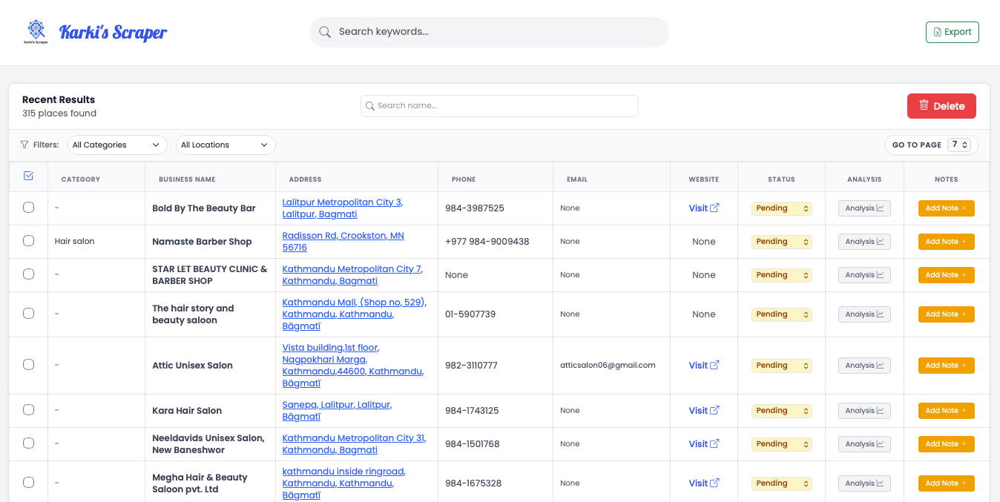

# Google Maps Scraper & Lead Dashboard



> **Disclaimer**: This project is created for **EDUCATIONAL PURPOSES ONLY**. It is intended to demonstrate the technical concepts of web scraping, data enrichment, and web application development. The creator is not responsible for any misuse of this tool. Please scrape responsibly, ethically, and strictly adhere to the Terms of Service of any websites you interact with. Do not use this tool to harm or spam anyone.

## Project Overview

This application acts as a complete pipeline for gathering and managing local business data. It automates the process of finding businesses, discovering their contact details (including emails), and providing a user-friendly interface to manage the leads.

**Primary Functions:**
1.  **Scrape**: Extracts public business information (Name, Address, Phone, Website) from Bing/Google Maps.
2.  **Enrich**: Uses an intelligent headless browser to visit business websites and find public email addresses.
3.  **Manage**: Provides a local web dashboard to view, filter, sort, and export the data.

## Features

-   **Multi-Stage Scraping**: Combines Scrapy for broad data gathering and Playwright for detailed enrichment.
-   **Email Discovery**: Intelligent algorithm to navigate websites and extract contact emails.
-   **Professional Dashboard**:
    -   Sortable and paginated data table (50 items per page).
    -   Professional "Jump to Page" navigation.
    -   Real-time status updates (Pending, Approved, Rejected).
    -   Notes and Analysis features for each lead.
-   **Data Management**:
    -   MongoDB integration for persistent storage.
    -   One-click Export to Excel (`.xlsx`).
    -   Automated merging of new data with existing records.
-   **Robust Architecture**: Clean separation of `data`, `scripts`, and application logic.

## Requirements

To run this project, you need the following installed:

-   **Python 3.8+**
-   **MongoDB** (running locally on default port 27017)
-   **Google Chrome / Chromium** (for Playwright)

**Python Packages:**
-   `Flask` (Web Framework)
-   `pandas` (Data Manipulation)
-   `playwright` (Browser Automation)
-   `Scrapy` (Web Scraping Framework)
-   `pymongo` (Database Connector)
-   `openpyxl` (Excel Support)

## Installation Setting Up

1.  **Clone the Repository**:
    ```bash
    git clone <repository-url>
    cd <repository-folder>
    ```

2.  **Set up Virtual Environment** (Recommended):
    ```bash
    python3 -m venv venv
    source venv/bin/activate
    ```

3.  **Install Dependencies**:
    ```bash
    pip install -r requirements.txt
    playwright install chromium
    ```

4.  **Start MongoDB**:
    Ensure your local MongoDB instance is running.

## Usage

### 1. Run the Scraper Pipeline
Use the automation script to start scraping. This runs the scraper, enriches data, and updates the database.
```bash
./run.sh "Your Search Query"
# Example: ./run.sh "Coffee Shops in Kathmandu"
```

### 2. Launch the Dashboard
Start the web interface to view and manage your data.
```bash
python run.py
```
Open your browser and navigate to: **[`http://localhost:5555`](http://localhost:5555)**

---

### File Structure
-   `run.py`: The entry point for the Flask web application.
-   `run.sh`: Master script that orchestrates the entire scraping and enrichment flow.
-   `scripts/`: Contains utility scripts (`enrich_emails.py`, `merge_to_excel.py`, `seed_db.py`).
-   `data/`: Stores generated CSVs, Excel files, and logs.
-   `google_maps_scraper/`: The Scrapy project files.

---

**Made by Shaksham Karki**
